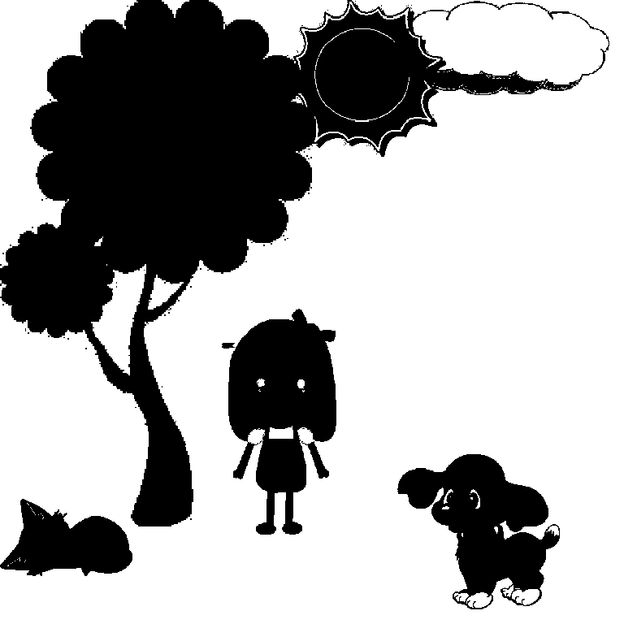

# GenerateData

GenerateData 是将

* mask 二值图，区分背景色和前景色的掩码图
* origin 图片，只包含前景色的图片
* colored 图片，人工上背景色后的图片

三种图片输入，通过 **替换着色** 和 **栅格化及搜索绘制曲线** 方式生成pix2pix可以接受的样本集的项目

## 要求

* 非Windows系统，如Ubuntu/MacOS
* OpenCV 3.2.0
* OpenCL 1.2


## 用法


进入 `GenerateData.cpp`, 修改
```c++
const string root_path = "../data";
const string save_path_name = "pair";    
const string mask_path = "inner_mask";
const string front_path = "foreground";
const string colored_path = "bg_by_user";
```
分别对应数据集的根目录、保存输入文件的根目录名字、掩码图片目录名字、前景图片目录名字、用户上色集合目录颜色

接着在CMakeLists.txt同级目录下
```sh

mkdir build
cd build
cmake ..
make
../GenerateData

```

大概需要 15分钟，视硬件性能而定

## 样例

输入

|          mask           |           origin           |         colored          |
| :---------------------: | :------------------------: | :----------------------: |
|  |  |  |

输出


